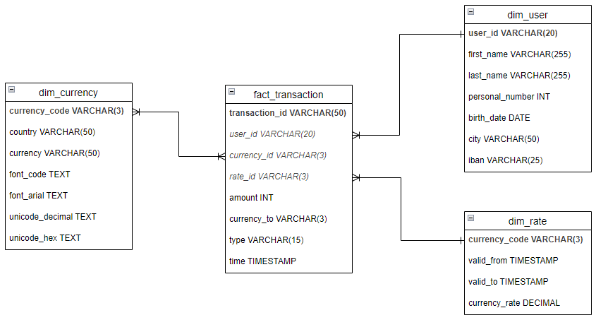

# Architecture of Data Warehousing and Normalization
In this section, interns will explore the layered architecture of the internit_db data warehouse, which is designed to support scalable, secure, and efficient data processing.

## Resources
[Data Warehouse Architecture Layers, Principles & Practices to Know on StreamSets](https://streamsets.com/blog/data-warehouse-architecture-explained/)\
[Modern Data Warehouses: Functions, Architecture, & Examples on Estuary](https://estuary.dev/modern-data-warehouse/)\
[How to evaluate and optimize data warehouse performance on TechTarget](https://www.techtarget.com/searchdatamanagement/tip/How-to-evaluate-and-optimize-data-warehouse-performance)\
[What is Normalization in DBMS (SQL)? 1NF, 2NF, 3NF Example on guru99.com](https://www.guru99.com/database-normalization.html)\
[The Problem of Redundancy in Database on GeeksforGeeks](https://www.geeksforgeeks.org/the-problem-of-redundancy-in-database/)\
[Anomalies in Relational Model on GeeksforGeeks](https://www.geeksforgeeks.org/anomalies-in-relational-model/)\
[Data Cleaning Challenge: Scale and Normalize Data on Kaggle](https://www.kaggle.com/code/rtatman/data-cleaning-challenge-scale-and-normalize-data)

## To Do List
* Design and document the three-layer architecture of the data warehouse.
* Create schemas and tables for each layer (raw, staging, trusted) in PostgreSQL.
* Load data into the raw layer from sources.
* Write SQL scripts to transform and normalize data into the staging layer.
* Apply denormalization techniques to prepare data for the trusted layer.
* Visualize the data flow between layers using diagrams or SQL views.

## Architecture of Data Warehousing
In `internit_db` database are created 3 layers:
* **raw** --> source data.
* **staging** --> transformed data.
* **trusted** --> consumtion data.

### Raw layer
Stores unprocessed, source-level data ingested directly from InternIT, ExchangeRate, and XE platforms. This layer ensures data traceability and acts as a historical archive.

#### Create layer
To create `raw` layer use the SQL query from `src/schemas/raw.sql` file.

#### Create tables

**internit_data**\
To create `internit_data` table use the code from `src/tables/raw/create_internit_table.sql` file.

**exchange_data**\
To create `exchange_data` table use the code from `src/tables/raw/create_exchange_table.sql` file.

**xe_data**\
To create `xe_data` table use the code from `src/extract/src/tables/raw/create_xe_table.sql` file.

#### Insert data
**internit_data**\
To insert data into `internit_data` table use the code from `src/tables/raw/insert_internit_table.sql` file.

**exchange_data**\
To insert data into `exchange_data` table use the code from `src/tables/raw/insert_exchange_table.sql` file.

**xe_data**\
To insert data into `xe_data` table use the code from `src/extract/src/tables/raw/insert_xe_table.sql` file.

#### Select data
**internit_data**\
To select data from `internit_data` table use the code from `src/tables/raw/select_internit_table.sql` file.

**exchange_data**\
To select data from `exchange_data` table use the code from `src/tables/raw/select_exchange_table.sql` file.

**xe_data**\
To select data from `xe_data` table use the code from `src/extract/src/tables/raw/select_xe_table.sql` file.

### Staging layer
Contains intermediate data that has been cleaned, validated, and transformed. This layer is used to prepare data for final consumption and supports data quality checks.

`fact_transaction`
| Column Name | Data Type | Description |
| ----- | ----- | ----- |
| transaction_id | VARCHAR(50) PRIMARY KEY | raw/internit_data/transaction_id |
| user_id | VARCHAR(20) FOREIGN KEY | raw/internit_data/user_id |
| currency_id | VARCHAR(3) FOREIGN KEY | raw/xe_data/currency_code |
| rate_id | VARCHAR(3) FOREIGN KEY | raw/exchange_data/currency_code |
| amount | INT | raw/internit_data/amount |
| currency_to | VARCHAR(3) | raw/internit_data/currency_to |
| type | VARCHAR(15) | raw/internit_data/type |
| time | TIMESTAMP | raw/internit_data/time |

`dim_user`
| Column Name | Data Type | Description |
| ----- | ----- | ----- |
| user_id | VARCHAR(20) PRIMARY KEY | raw/internit_data/user_id |
| first_name | VARCHAR(255) | raw/internit_data/first_name |
| last_name | VARCHAR(255) | raw/internit_data/last_name |
| personal_number | INT | raw/internit_data/personal_number |
| birth_date | DATE | raw/internit_data/birth_date |
| city | VARCHAR(50) | raw/internit_data/city |
| iban | VARCHAR(25) | raw/internit_data/iban |

`dim_rate`
| Column Name | Data Type | Description |
| ----- | ----- | ----- |
| currency_code | VARCHAR(3) PRIMARY KEY | raw/exchange_data/currency_code |
| valid_from | TIMESTAMP |  raw/exchange_data/time_last_update_unix |
| valid_to | TIMESTAMP | raw/exchange_data/time_next_update_unix |
| currency_rate | DECIMAL | raw/exchange_data/currency_rate |

`dim_currency`
| Column Name | Data Type | Description |
| ----- | ----- | ----- |
| currency_code | VARCHAR(3) PRIMARY KEY | raw/xe_data/currency_code |
| country | VARCHAR(50) | raw/xe_data/country_and_currency |
| currency | VARCHAR(50) | raw/xe_data/country_and_currency |
| font_code | TEXT | raw/xe_data/font_code|
| font_arial | TEXT | raw/xe_data/font_arial |
| unicode_decimal | TEXT | raw/xe_data/unicode_decimal |
| unicode_hex | TEXT | raw/xe_data/unicode_hex |

### Trusted layer
Holds the final, business-ready data models used for analytics, dashboards, and reporting. This layer is optimized for performance and is the foundation for decision-making.

`intern`
| Column Name | Data Type | Description |
| ----- | ----- | ----- |
| transaction_id | VARCHAR(50)| staging/fact_transaction |
| first_name | VARCHAR(255)| staging/dim_user |
| last_name | VARCHAR(255)| staging/dim_user | 
| city | VARCHAR(50)| staging/dim_user | 
| currency | VARCHAR(50)| staging/dim_currency | 
| amount_standard | BIGINT| staging/dim_rate | 
| type | VARCHAR(15)| staging/fact_transaction | 
| time | TIMESTAMP| staging/fact_transaction | 

## Normalization
Normalization is a process used to reduce redundancy and improve data integrity in relational databases.

Key Concepts:
* First Normal Form (1NF), Second Normal Form (2NF), and Third Normal Form (3NF).
* Benefits and trade-offs of normalization vs denormalization.
* Application of normalization in the staging layer and denormalization in the trusted layer for analytics.

For normalization operation use *Star Schema* presented in `src/star_schema.drawio` that can be viewed in *VS Code* or using [Drawio in browser](https://www.drawio.com/).

